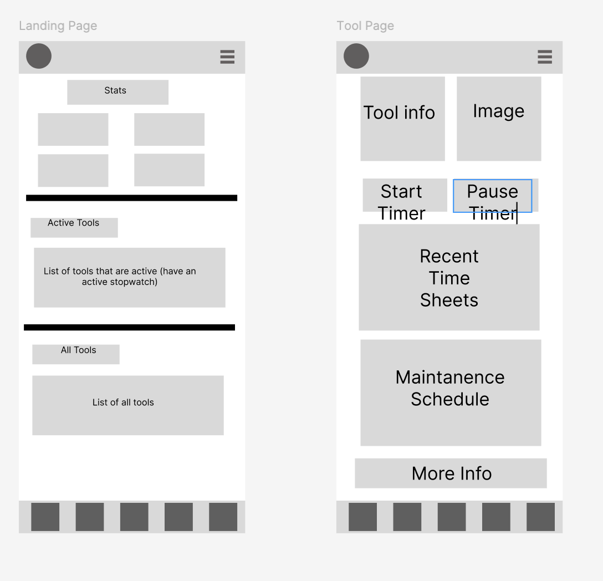

# ApexTracking

A React Native application that tracks the usage time and maintenance of equipment.

Currently you can interact with a few items on the home screen, but the main part for the project is on the 'Tools' screen. Here you can add a tool and see the 'All Tools' list update with the new tool added.

# Screenshots

# Packages Used

- @react-native-community/datetimepicker
- import { Tabs } from "expo-router";

## (Potential Future Packages)

- expo-document-picker
- Stopwatch Timer (https://github.com/rgommezz/react-native-animated-stopwatch-timer)
- React Native Paper
- react-reanimated
- expo-blur

# Necessary Components

- Title component
- Stats component
- List of All Tools (each tool in list is pressable)
- Individual Tool component
  - Image
  - Tool info
    - Purchased date
    - New / Used (if used ask total hours of usage)
    - Upload maintenance manual
  - Stop Watch component (saves to recent times when stopped)
